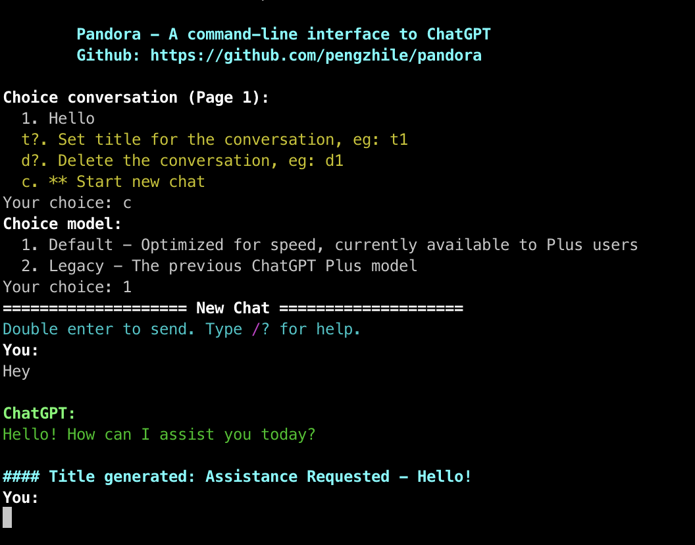
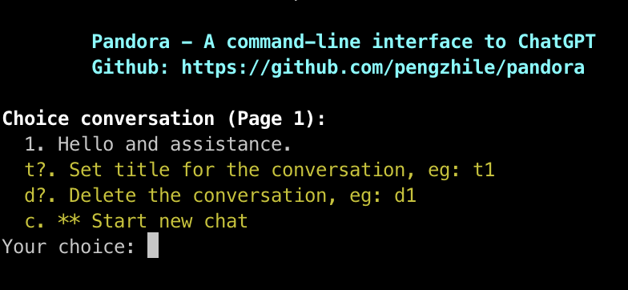
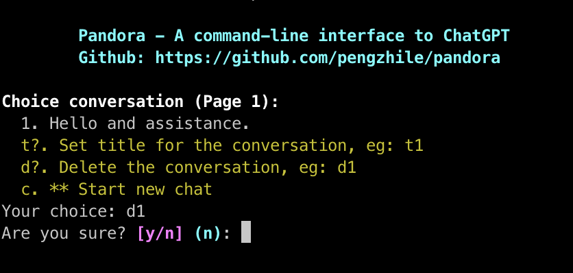
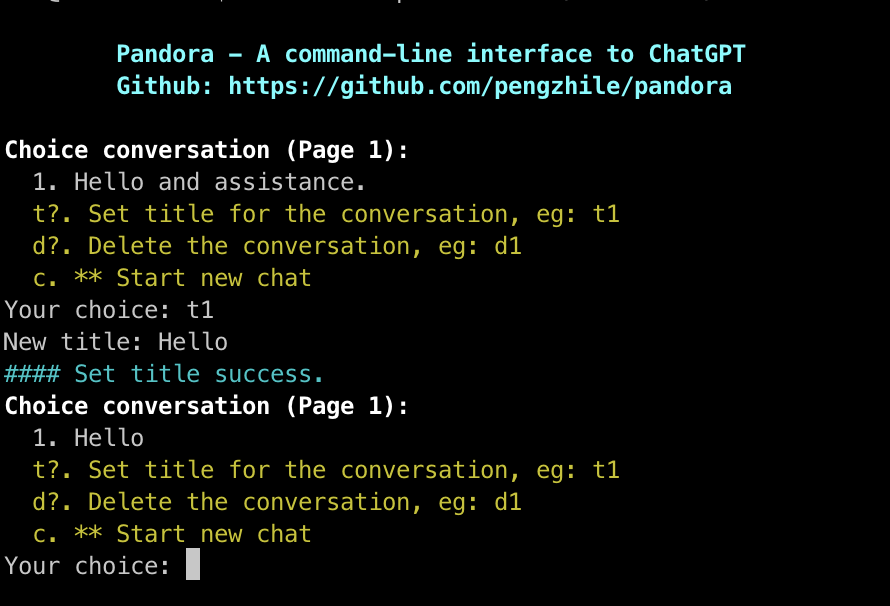
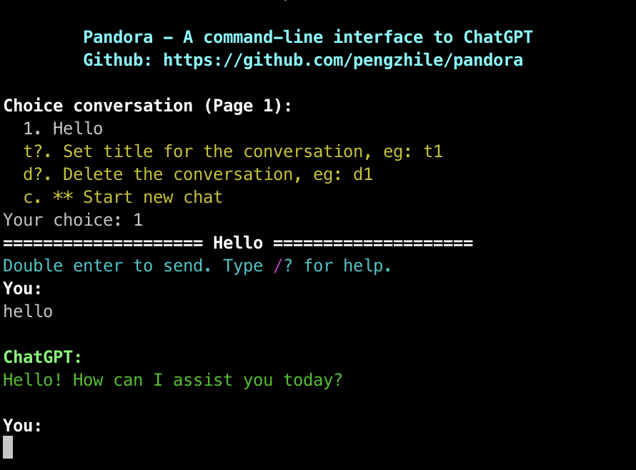
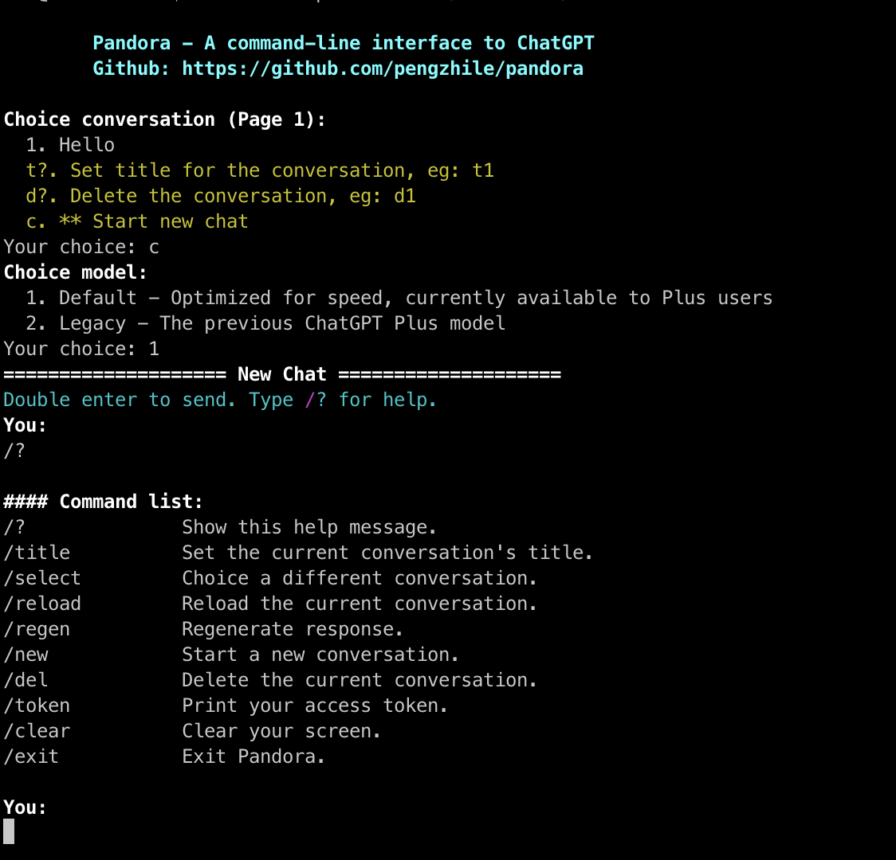

# Pandora

[中文版本](../README.md)

### `Pandora`, a command-line `ChatGPT`.
### Implements main operations of web version `ChatGPT`. Passes through `Cloudflare`, theoretically, it works fast.

## Screenshots

  <details>

  <summary>

  

  </summary>

  
  
  
  
  

</details>

## How to Run:

* Python version must be at least `3.7`.

* Run with pip

  ```shell
  pip install Pandora-ChatGPT
  pandora
  ```

* Run with compilation

  ```shell
  pip install .
  pandora
  ```

* Run with Docker:

  ```shell
  docker build -t pandora .
  docker run -it --rm pandora
  ```

* Simple, straightforward, and elegant.

## Program Arguments

* Use `pandora --help` to view the list of program arguments.
* `-p` or `--proxy` specify a proxy, in the format of `http://user:pass@ip:port`.
* `-t` or `--token_file` specify a file that stores the `Access Token`, and log in using the `Access Token`.
* `-v` or `--verbose` displays debugging information, and prints the exception stack trace when an error occurs, for debugging purposes.

## About Access Token
* Log in with the `Access Token` allows you to bypass the proxy.
* It is usually used by those who log in to `ChatGPT` with their `Google` or `Microsoft` accounts.
* Firstly, log in to `ChatGPT` normally, whether it's with a username and password, or with `Google` or `Microsoft`.
* After successfully logging in, go to the chat page and open the URL `https://chat.openai.com/api/auth/session`.
* The long string of characters in the `accessToken` field is your `Access Token`.
* The `Access Token` can be copied and saved, and its validity period is currently `1 month`.
* Do not leak your `Access Token`, as it can manipulate your account.

## Command Operations

* In the conversation interface, press `Enter` twice to send your input to `ChatGPT`.
* In the conversation interface, use `/?` to print the supported command operations.
* `/title` re-sets the title of the current conversation.
* `/select` returns to the conversation selection interface.
* `/reload` reloads all the contents of the current conversation, like pressing `F5`.
* `/regen` if you are not satisfied with `ChatGPT`'s current response, you can ask it to re-answer.
* `/new` opens a new conversation directly.
* `/del` deletes the current conversation and returns to the conversation selection interface.
* `/token` prints the current `Access Token`, which you may need, but do not leak it.
* `/clear` clears the screen.
* `/exit` exits Pandora.

## Other Information

* Pandora is an open-source project that stands on the shoulders of other giants, thank you!
* Raise an issue for any errors or bugs you encounter, and the developer will fix them as soon as possible.
* The developer may not be able to keep up with the changes in the `ChatGPT` API in the future.
* If you like it, give the project a star, we are all old friends.
* This `README` is translated by `ChatGPT`.